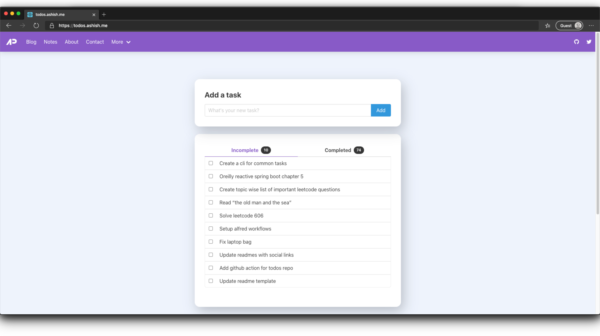

  

<h2 align="center">todos.ashish.me</h2>

📦 my todo list management app built with react 

  

## Stats

<!-- week starts --><b>Week</b> - 2 tasks completed (07-June - 13-June) <!-- week ends -->
<!-- month starts --><b>Month</b> - 2 tasks completed (Jun 2021) <!-- month ends -->
<!-- year starts --><b>Year</b> - 43 tasks completed (Year 2021)<!-- year ends -->

## Todos

<!-- todos starts -->
◻️  &nbsp; Secops review ◻️  &nbsp; Fix codesmells ◻️  &nbsp; Update checklist ◻️  &nbsp; Create postman collection ◻️  &nbsp; Clean kitchen ◻️  &nbsp; Stop some of the credit card subscriptions ◻️  &nbsp; Arrange documents for visa ◻️  &nbsp; Organize documents ◻️  &nbsp; Backup photo ◻️  &nbsp; Fix laptop bag ◻️  &nbsp; Setup alfred workflows
<!-- todos ends -->

## Last 20 completed todos

<!-- completed starts -->
✅  &nbsp; Get water can - **_Jun 07 2021_** ✅  &nbsp; Create demo for wednesday - **_Jun 07 2021_** ✅  &nbsp; Update terraform script - **_May 20 2021_** ✅  &nbsp; Get water can, black ring for cooket - **_May 19 2021_** ✅  &nbsp; Change client secret - **_May 19 2021_** ✅  &nbsp; Buy mango pickle - **_May 09 2021_** ✅  &nbsp; Buy garbage bag - **_May 09 2021_** ✅  &nbsp; Update connector doc - **_May 08 2021_** ✅  &nbsp; Pay maid - **_May 08 2021_** ✅  &nbsp; Update readmes with social links - **_May 06 2021_** ✅  &nbsp; Solve leetcode 606 - **_May 06 2021_** ✅  &nbsp; Pay rent - **_May 03 2021_** ✅  &nbsp; Read “the old man and the sea” - **_May 03 2021_** ✅  &nbsp; Pay bills - **_May 01 2021_** ✅  &nbsp; Recharge vodaphone - **_May 01 2021_** ✅  &nbsp; Get pcc - **_May 01 2021_** ✅  &nbsp; Buy ginger powder - **_Apr 30 2021_** ✅  &nbsp; Work on sync todo script - **_Apr 30 2021_** ✅  &nbsp; Create a cli for common tasks - **_Apr 25 2021_** ✅  &nbsp; Buy tumeric, chilli powder, oil - **_Apr 24 2021_**
<!-- completed ends -->
