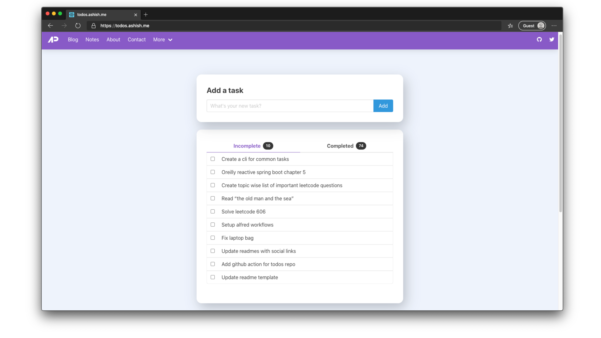

  

<h2 align="center">todos.ashish.me</h2>

📦 my todo list management app built with react 

  

## Tasks Completed

<!-- week starts --><b>Current Week</b> - 5 
 <b>Previous Week</b> - 0<!-- week ends --> 
<!-- month starts --><b>Current Month</b> - 16 
 <b>Previous Month</b> - 11<!-- month ends --> 
<!-- year starts --><b>Current Year</b> - 16 
 <b>Previous Year</b> - 138<!-- year ends --> 

## Todos

<!-- todos starts -->
◻️ &nbsp; Update main website ◻️ &nbsp; Verify custom domain for github pages ◻️ &nbsp; Follow up with ikea for refund ◻️ &nbsp; Buy colgate ◻️ &nbsp; Selfhost freshrss ◻️ &nbsp; Fix date picker in dashboard ◻️ &nbsp; Move word, quote, shortner to new api ◻️ &nbsp; Update books and others endpoint ◻️ &nbsp; Shut down old api ◻️ &nbsp; Fix link and font size in featured work
<!-- todos ends -->

## Last 20 completed todos

<!-- completed starts -->
✅ &nbsp; Switch ls with exa in dotfiles - **_Jan 20 2022_** ✅ &nbsp; Add alias for opening finder - **_Jan 20 2022_** ✅ &nbsp; Cdo report [deadline 15 jan] - **_Jan 17 2022_** ✅ &nbsp; Complete ci/cd for cdo report - **_Jan 17 2022_** ✅ &nbsp; Complete conclusion for cdo report - **_Jan 17 2022_** ✅ &nbsp; Complete abstract for cdo report - **_Jan 15 2022_** ✅ &nbsp; Ca report [deadline 12 jan] - **_Jan 13 2022_** ✅ &nbsp; Cpp report  [deadline 10 jan] - **_Jan 10 2022_** ✅ &nbsp; Complete architectural design for cpp report - **_Jan 10 2022_** ✅ &nbsp; Complete proposed cloud based solution for cpp report - **_Jan 10 2022_** ✅ &nbsp; Complete functional and non functional requirements for cpp report - **_Jan 10 2022_** ✅ &nbsp; Blockchain report  [deadline 6 jan] - **_Jan 07 2022_** ✅ &nbsp; Buy chicken nuggets, orange juice - **_Jan 06 2022_** ✅ &nbsp; Create service account for system api - **_Jan 05 2022_** ✅ &nbsp; Fix typo in dashboard app - **_Jan 05 2022_** ✅ &nbsp; Pay credit card bills - **_Jan 04 2022_** ✅ &nbsp; Buy coffee - **_Dec 26 2021_** ✅ &nbsp; Buy cake - **_Dec 21 2021_** ✅ &nbsp; Recharge indian mobile number - **_Dec 21 2021_** ✅ &nbsp; Complete blockchain report - **_Dec 17 2021_**
<!-- completed ends -->
